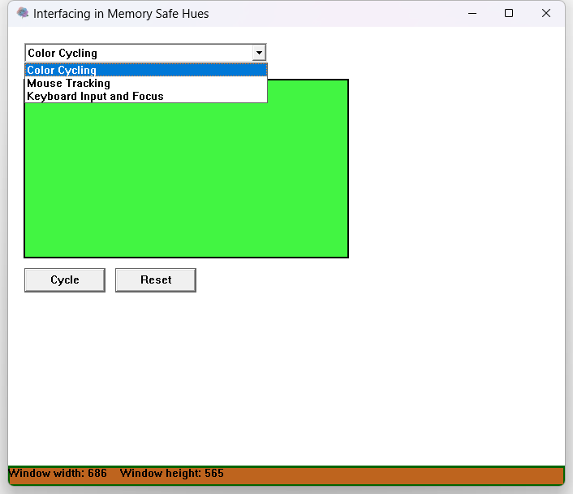

# LaGuiEnC

A native Win32 API sandbox written in C for exploring Windows
messages, controls, custom drawing, retained state, and layout.



## Demonstrations

### Color Cycling

Demonstrates:

- `WM_COMMAND`
- Button notifications
- Retained application state
- Targeted repainting

### Mouse Tracking

Demonstrates:

- `WM_MOUSEMOVE`
- Client-area coordinates
- Selective invalidation

### Keyboard Input and Focus

Demonstrates:

- `WM_KEYDOWN` and `WM_KEYUP`
- `WM_SETFOCUS` and `WM_KILLFOCUS`
- Virtual-key values
- Keyboard focus transfer

## Running

Download the latest Windows release, extract the ZIP, and run
`LaGuiEnC.exe`.

## Building

Requirements:

- Windows
- MinGW GCC
- GNU Make
- `windres`

Build:

```
make
```

Remove generated files:

```
make clean
```
